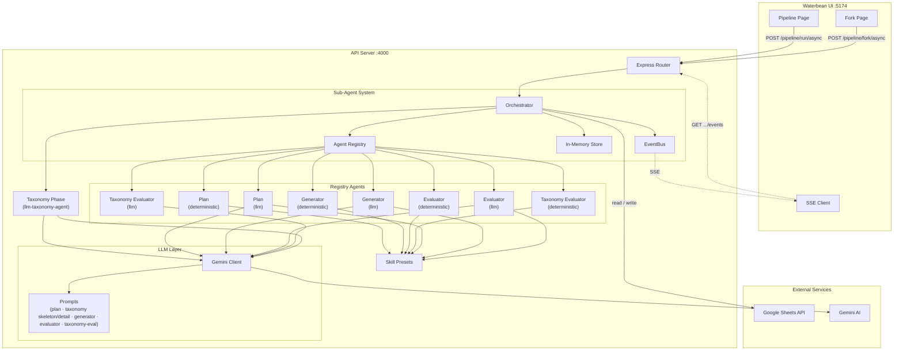
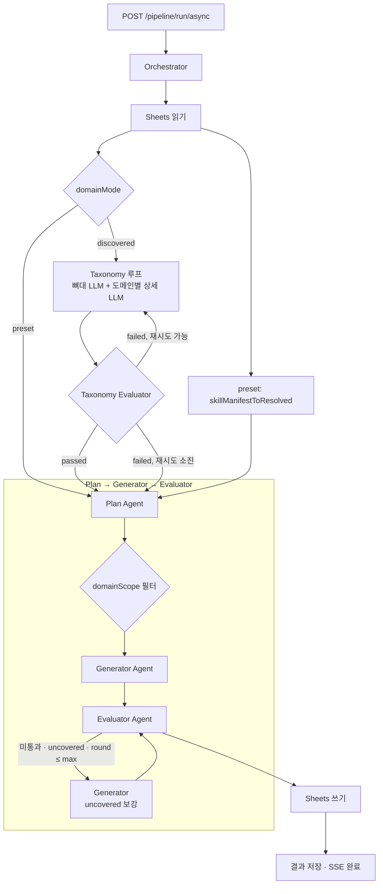

# Partner Center

Google Sheets 기능 목록으로부터 QA Test Case를 자동 생성하는 도구입니다.

## 프로젝트 구조

```
partner-center/
├── api/                        # Express 백엔드 — TC 생성 파이프라인
│   └── src/
│       ├── agents/             #   Sub-Agent · Orchestrator · EventBus · Registry · Store
│       ├── config/             #   환경 변수
│       ├── llm/                #   Gemini 클라이언트 · 프롬프트 (plan / taxonomy / generator / evaluator 등)
│       ├── pipeline/           #   Plan · Generator · Evaluator · Taxonomy 규칙 검증
│       ├── routes/             #   API 라우트 (동기/비동기/SSE)
│       ├── sheets/             #   Sheets 읽기 · 쓰기
│       ├── skills/             #   스킬 프리셋 (도메인 키워드 · TC 템플릿)
│       └── types/              #   타입 정의 (Pipeline, TC, Fork)
├── web/                        # React SPA — Partner Center Web (Vite 기본 포트)
├── waterbean/                  # React SPA — TC Harness (파이프라인 / Fork UI, :5174)
│   └── src/
│       ├── features/
│       │   ├── pipeline/       #   파이프라인 실행 · 결과 뷰
│       │   └── fork/           #   Fork 비교 실행 · 결과 뷰
│       └── shared/             #   공통 UI · API 클라이언트 · SSE · i18n
└── docs/                       # 매뉴얼 · 설계 문서
```

| 워크스페이스 | 포트 | 스택 | 설명 |
|---|---|---|---|
| `api` | 4000 | Express 5 · Google Sheets API · Gemini AI · Zod | TC 생성 파이프라인 API 서버 |
| `web` | 5173 (기본) | React · Vite · Tailwind | Partner Center Web |
| `waterbean` | 5174 | React 19 · Vite 8 · Tailwind 4 | Pipeline / Fork 실행 UI |

## 시작하기

### 사전 준비

- Node.js 20+
- Google Cloud 서비스 계정 키 파일 (Sheets API 권한)
- Gemini API 키 (`domainMode: discovered` 또는 `implementation: llm` 사용 시)

### 설치

```bash
npm install
```

### 환경 변수

`api/.env`에 설정합니다. 템플릿은 `api/.env.example`을 참고하세요.

```bash
cp api/.env.example api/.env
```

| 변수 | 설명 | 기본값 |
|---|---|---|
| `GOOGLE_SERVICE_ACCOUNT_KEY_PATH` | 서비스 계정 키 JSON 경로 (api/ 기준 상대경로) | `../sa.json` |
| `PORT` | API 서버 포트 | `4000` |
| `GEMINI_API_KEY` | Gemini API 키 | — |
| `GEMINI_MODEL` | 사용할 Gemini 모델 | `gemini-2.5-flash-lite` |
| `LLM_MAX_TOKENS` | LLM 최대 출력 토큰 (`maxOutputTokens`) | `8192` |
| `LLM_TEMPERATURE` | LLM Temperature | `1.0` |
| `LLM_TIMEOUT_MS` | LLM 요청 타임아웃 (ms) | `30000` |
| `LLM_JSON_LOG_CHARS` | JSON 파싱 실패 시 터미널 로그 최대 문자 수 (선택) | `65536` |
| `PIPELINE_EVAL_SPEC_GROUNDING` | D-Evaluator 스펙 근거 게이트 기본값: `off` \| `warn` \| `block` (API 미지정 시) | 미설정 시 `warn` |
| `PIPELINE_EVAL_TRACEABILITY` | Traceability `R행` 정합 게이트 기본값: `off` \| `warn` \| `block` | 미설정 시 `warn` |
| `PIPELINE_DEBUG_DIR` | Plan/Generator 디버그 JSON 저장 디렉터리. 설정 시 완료 후 `{dir}/{pipelineId}/artifacts/pipeline-result.json`에 최종 통계·Evaluator 이슈도 기록 | — (비활성) |

### 개발 서버 실행

```bash
# 전체: API가 /health 로 준비된 뒤 web + waterbean 동시 기동
npm run dev

# 개별 실행
npm run dev:api        # API (:4000)
npm run dev:web        # Web (Vite 기본 포트)
npm run dev:waterbean  # Waterbean (:5174)
```

`PORT`를 바꾼 경우, 루트 `package.json`의 `dev:clients`에 있는 `wait-on` URL도 같은 포트로 맞춰야 합니다.

### 빌드

```bash
npm run build   # 전체 워크스페이스 빌드
npm run lint    # 전체 워크스페이스 린트
```

## 시스템 구성도



## 아키텍처

### Sub-Agent 시스템

Plan · Generator · Evaluator · **Taxonomy Evaluator**는 **Agent Registry**에 등록되며, 요청의 `implementation`(`deterministic` / `llm`)에 따라 구현체가 선택됩니다.

**Taxonomy(도메인 뼈대 + 도메인별 상세)** 는 Registry가 아니라 Orchestrator가 [`llm-taxonomy-agent`](api/src/agents/llm-taxonomy-agent.ts)를 직접 호출합니다.

| 구현체 | 설명 |
|---|---|
| `deterministic` | 규칙 기반 처리 (키워드 매칭, 템플릿 조합, Zod/스키마 검증) |
| `llm` | Gemini 기반 생성·수정 (Evaluator는 규칙 검증 후 필요 시 repair 등) |

### 핵심 모듈

| 모듈 | 위치 | 역할 |
|---|---|---|
| Orchestrator | `api/src/agents/orchestrator.ts` | 시트 읽기, Taxonomy·Taxonomy Evaluator 재시도, Plan→Generator→Evaluator, 폴백 라운드, 쓰기 |
| EventBus | `api/src/agents/event-bus.ts` | 에이전트 이벤트 · SSE 브리지 |
| Agent Registry | `api/src/agents/registry.ts` | 에이전트 등록 · 조회 |
| In-Memory Store | `api/src/agents/store.ts` | 실행 상태 저장 (TTL GC) |
| Gemini Client | `api/src/llm/gemini-client.ts` | 생성 · Zod 검증 · JSON 추출/복구 · `LlmJsonParseError` 시 로그/UI용 `llmJsonFailureLog` |

### domainMode

요청 본문 `domainMode`로 도메인 정의 방식을 고릅니다 (기본값 `preset`).

| 값 | 설명 |
|---|---|
| `preset` | 스킬 프리셋의 고정 7도메인을 [`skillManifestToResolved`](api/src/skills/resolved-skill.ts)로 사용 |
| `discovered` | **Taxonomy**: (1) LLM으로 도메인 id 뼈대, (2) 도메인마다 LLM으로 `keywords`·`minSets`·`templates` 생성 후 merge. 이어서 **Taxonomy Evaluator**로 품질 검증 후, 미통과 시 Taxonomy를 최대 2회 재시도하고, 그래도 실패하면 현재 결과로 진행. **`domainScope`는 `ALL`만 허용**, `GEMINI_API_KEY` 필수 |

## 파이프라인 흐름



- **Taxonomy Evaluator**: `ResolvedSkill` 기준 규칙 검증 + (`llm` 구현 시) 샘플 대비 LLM 검증.
- **Evaluator**: TC 스키마, 필수 필드, 도메인 최소 세트, 커버리지, 중복 검사. `llm` 모드에서 repair 라운드 가능.
- **Fallback**: `maxFallbackRounds`까지 uncovered 기반 Generator 재실행.

LLM JSON 파싱 실패 시 API 로그와(터미널) 비동기 파이프라인 결과의 **`llmJsonFailureLog`** 필드(Waterbean 이슈 패널)에 디버그 문자열이 채워질 수 있습니다.

## 진단 체크리스트 (코드 변경 없이)

`domainMode: discovered`에서 도메인 분포가 한쪽으로 쏠리거나(예: 첫 도메인만 과다), 분류 품질이 급격히 저하될 때 운영 중 바로 점검할 항목입니다.

### 1) 기본 전제 확인

- 요청이 실제로 `domainMode: discovered`인지 확인 (`preset`이면 taxonomy가 아니라 프리셋 도메인 사용).
- `implementation`(plan/generator/evaluator) 조합과 `domainScope` 값이 의도와 일치하는지 확인.
- `GEMINI_API_KEY`, `GEMINI_MODEL`, `LLM_MAX_TOKENS`, `LLM_TIMEOUT_MS` 환경변수 값 재확인.

### 2) Taxonomy 단계 성공/재시도 여부 확인 (SSE/터미널)

- Waterbean의 에이전트 진행에서 `taxonomy` → `taxonomy-evaluator` 흐름이 반복되는지 확인.
- 반복이 많으면 taxonomy 품질 이슈로 재시도가 소진되는 상황일 수 있음.
- 터미널에서 다음 키워드가 보이면 원인 단서를 기록:
  - `removed ... overlapped keywords by domain order`
  - `키워드 미달 ... 도메인 보정 중`
  - `LlmJsonParseError`, `rate limited`, `retrying`

### 3) fallback 쏠림 가능성 확인

- 현재 구조는 키워드 미매칭 시 `fallbackDomain`으로 분류됨.
- `fallbackDomain`은 discovered taxonomy의 `domainOrder` 첫 번째 도메인으로 설정됨.
- 따라서 결과 분포가 `첫 도메인만 과다 + 나머지 0`이면, 대부분이 키워드 미매칭으로 fallback된 패턴일 가능성이 높음.

### 4) 실행 결과 데이터에서 즉시 확인할 지표

- 도메인별 체크리스트 개수 분포(0개 도메인 수, 최댓값/최솟값 비율).
- taxonomy 평가 이슈 존재 여부:
  - `taxonomy_keyword_overlap`
  - `taxonomy_keyword_quality`
  - `taxonomy_balance`
- `llmJsonFailureLog` 존재 여부 (JSON 파싱 실패/잘림/모델 응답 이상).

### 5) 운영 파라미터로 가능한 완화 (코드 수정 없음)

- `LLM_MAX_TOKENS`를 충분히 확보하고, `LLM_TIMEOUT_MS`를 상향해 중간 잘림/타임아웃 가능성 완화.
- 레이트리밋이 잦으면 요청 동시 실행 환경을 낮추거나 재실행 간격을 두고 수행.
- 입력 시트에서 분류 단서 컬럼(대/중/소분류, 기능명, 요구사항ID)이 비어 있거나 난해한 경우 데이터 정규화 후 재실행.

### 6) 재현/비교 운영 절차

- 동일 시트로 2회 이상 실행해 분포 패턴 재현 여부 확인.
- 동일 입력에서 모델만 바꿔(`GEMINI_MODEL`) 분포와 taxonomy 이슈 변화를 비교.
- 개선/악화 판단은 단건 감각 대신 아래 3개를 함께 비교:
  - 도메인 분포 균형
  - taxonomy 이슈 건수
  - 총 처리 시간(재시도 포함)

## 스킬 프리셋

`api/src/skills/presets/` JSON으로 TC 생성 전략을 정의합니다.

| 프리셋 | 설명 |
|---|---|
| `default.json` | 7도메인 범용 (Auth, Payment, Content, Membership, Community, Creator, Admin) |
| `auth-focused.json` | Auth·Security 강조 프리셋 |
| `sheet-grounded.json` | 기능명·기능설명에만 근거하도록 policyHints·min set 완화 (PG 등 과생성 억제) |

각 프리셋: **domainKeywords**, **templates**, **domainMinSets**, **priorityRules** / **severityRules**.

`GET /pipeline/skills`로 목록 조회.

파이프라인 요청(`POST /pipeline/run`, `/pipeline/run/async` 등) 본문에 `skillId: "sheet-grounded"` 를 넣으면 위 프리셋이 적용된다(기본값은 `default`).

## API 엔드포인트

### 공통

| 메서드 | 경로 | 설명 |
|---|---|---|
| `GET` | `/health` | 헬스체크 |
| `GET` | `/pipeline/skills` | 스킬 목록 |
| `GET` | `/pipeline/agents` | 등록 에이전트 목록 |

### Pipeline

| 메서드 | 경로 | 설명 |
|---|---|---|
| `POST` | `/pipeline/run` | 동기 실행 |
| `POST` | `/pipeline/run/async` | 비동기 (`pipelineId`) |
| `GET` | `/pipeline/run/:id/events` | SSE 진행 |
| `GET` | `/pipeline/run/:id/result` | 결과 |
| `GET` | `/pipeline/run/:id/agents` | 에이전트 상태 |
| `POST` | `/pipeline/notify` | 알림 스켈레톤(본문 검증·로그만, 실제 웹훅 없음) |

`POST /pipeline/run`·`/pipeline/run/async` JSON에 선택 필드 **`evalSpecGrounding`**, **`evalTraceability`** (`off` \| `warn` \| `block`)를 넣을 수 있다. 기본 `warn`은 해당 이슈(`spec_ungrounded`, `traceability_mismatch`)가 있어도 파이프라인 `success`/`passed`에 반영하지 않는다. **`block`**이면 해당 이슈가 `passed`를 막는다.

### Fork

| 메서드 | 경로 | 설명 |
|---|---|---|
| `POST` | `/pipeline/fork` | 동기 Fork |
| `POST` | `/pipeline/fork/async` | 비동기 Fork |
| `GET` | `/pipeline/fork/:id/events` | Fork SSE |
| `GET` | `/pipeline/fork/:id/result` | Fork 결과 |

## i18n

`waterbean`은 `react-i18next` 기반 다국어를 지원합니다.

- 기본: 한국어(ko), 영어(en)
- `waterbean/src/shared/locales/ko.json`, `en.json`

## 문서

- [QA TC 시트 매뉴얼](docs/QA-TC-시트-매뉴얼.md)
- [TC 파이프라인 리팩토링 방안](docs/TC-파이프라인-리팩토링-방안.md)
- [TC 파이프라인 후속 개발 로드맵](docs/TC-파이프라인-후속-개발-로드맵.md) (Phase C 이후 S1~S6)
- [Sub-Agent 설계 로드맵](docs/TODO-sub-agent.md) (참고용 메모)
