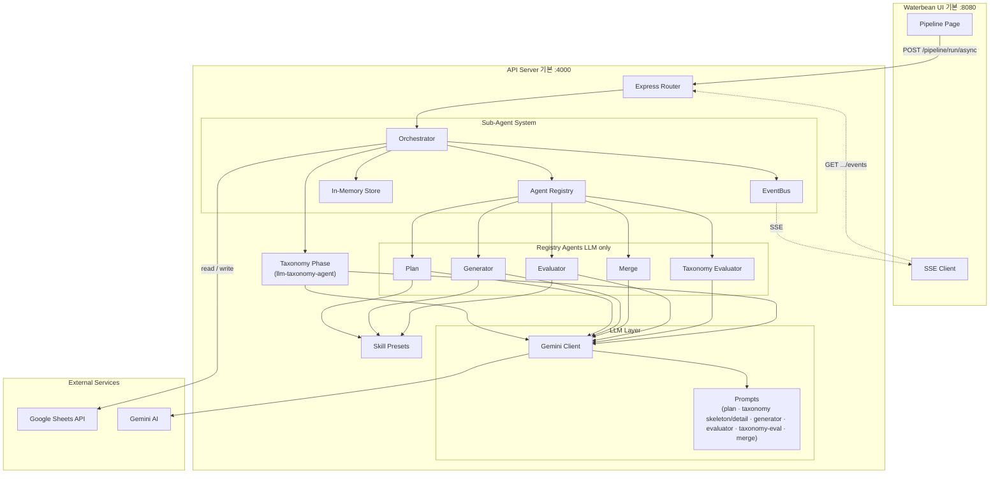
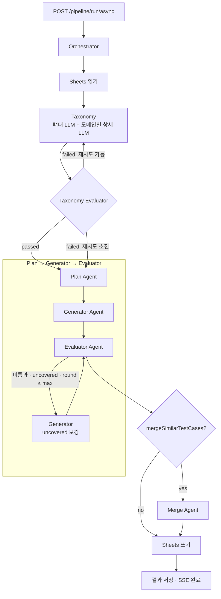

# Waterbean

GitHub 저장소명 **waterbean**. Google Sheets 기능 목록으로부터 QA Test Case를 자동 생성하는 도구입니다. **Express API**가 파이프라인(Plan · Taxonomy · Generator · Evaluator · Merge 등)을 수행하고, **waterbean**은 파이프라인 실행과 SSE 모니터링용 React UI입니다.

npm workspaces 기반 모노레포이며, 루트에서 의존성 설치·스크립트를 일괄 실행할 수 있습니다.

## 프로젝트 구조

```
waterbean/
├── api/                        # Express 백엔드 — TC 생성 파이프라인
│   └── src/
│       ├── agents/             #   Orchestrator · Registry · EventBus · Store · LLM 에이전트
│       ├── config/             #   환경 변수 · Sheets 설정
│       ├── llm/                #   Gemini 클라이언트 · 프롬프트 (plan / taxonomy / generator / evaluator 등)
│       ├── pipeline/           #   Plan · Generator · Evaluator · Taxonomy 검증 · runner · spec-risk · tc-enrich 등
│       ├── routes/             #   API 라우트 (동기/비동기/SSE)
│       ├── sheets/             #   Sheets 읽기 · 쓰기
│       ├── skills/             #   스킬 프리셋 · registry · resolved-skill
│       └── types/              #   타입 정의 (Pipeline, TC)
└── waterbean/                  # React SPA — TC Harness (파이프라인 UI, 기본 :8080)
    └── src/
        ├── app/                #   라우팅 · 레이아웃
        ├── features/
        │   ├── pipeline/       #   파이프라인 실행 · 결과 뷰
        │   └── settings/       #   설정 화면
        └── shared/             #   공통 UI · API 클라이언트 · SSE · i18n
```


| 워크스페이스      | 포트                                            | 스택                                              | 설명                                   |
| ----------- | --------------------------------------------- | ----------------------------------------------- | ------------------------------------ |
| `api`       | 4000 (기본, `api/.env`의 `API_PORT`)             | Express 5 · Google Sheets API · Gemini AI · Zod | TC 생성 파이프라인 API 서버                   |
| `waterbean` | 8080 (기본, `waterbean/.env`의 `WATERBEAN_PORT`) | React 19 · Vite 8 · Tailwind 4                  | Pipeline 실행 UI (`/api` → 로컬 API 프록시) |


## 시작하기

### 사전 준비

- Node.js 20+
- Google Cloud 서비스 계정 키 파일 (Sheets API 권한)
- Gemini API 키 (**파이프라인 필수**: Taxonomy·Plan·Generator·Evaluator·Merge 모두 LLM)

### 설치

```bash
npm install
```

### 환경 변수

#### API (`api/.env`)

템플릿·주석 전체는 `api/.env.example`을 따릅니다.

```bash
cp api/.env.example api/.env
```


| 변수                                          | 설명                                                                                                                      | 기본값                          |
| ------------------------------------------- | ----------------------------------------------------------------------------------------------------------------------- | ---------------------------- |
| `GOOGLE_SERVICE_ACCOUNT_KEY_PATH`           | 서비스 계정 키 JSON 경로 (api/ 기준 상대경로 또는 절대경로, Cloud Run에서는 Secret 마운트 경로 권장)                                                  | `../sa.json`                 |
| `DOTENV_CONFIG_PATH`                        | 로드할 env 파일 경로 (Secret Manager 파일 마운트 등). 미설정 시 `api/.env`                                                               | —                            |
| `API_PORT`                                  | API 서버 리슨 포트                                                                                                            | `4000`                       |
| `GEMINI_API_KEY`                            | Gemini API 키                                                                                                            | —                            |
| `GEMINI_MODEL`                              | 사용할 Gemini 모델                                                                                                           | `gemini-2.5-flash-lite`      |
| `LLM_MAX_TOKENS`                            | LLM 최대 출력 토큰 (`maxOutputTokens`)                                                                                        | `8192`                       |
| `LLM_TEMPERATURE`                           | LLM Temperature                                                                                                         | `1.0`                        |
| `LLM_TIMEOUT_MS`                            | LLM 요청 타임아웃 (ms)                                                                                                        | `30000`                      |
| `LLM_JSON_LOG_CHARS`                        | JSON 파싱 실패 시 터미널 로그 최대 문자 수 (선택)                                                                                        | `65536`                      |
| `LLM_PLAN_CHUNK_SIZE`                       | Plan 단계 시트 행 청크 크기                                                                                                      | `10`                         |
| `LLM_PLAN_CONCURRENCY`                      | Plan 청크 LLM 동시 호출 수 (1~8)                                                                                               | `3`                          |
| `LLM_GEN_CHUNK_SIZE`                        | Generator 청크(체크리스트 건수)                                                                                                  | `5`                          |
| `LLM_MERGE_CHUNK_SIZE`                      | Merge 단계 청크 크기                                                                                                          | `20`                         |
| `LLM_GEN_BATCH_SIZE`                        | Orchestrator가 Generator·Evaluator에 넘기는 배치 크기(건)                                                                         | `20`                         |
| `PIPELINE_HIGH_RISK_MAX_TC_PER_REQUIREMENT` | `specRiskTier` high 행의 Requirement_ID당 TC 상한 (API 미지정 시, 최소 2)                                                          | `6`                          |
| `PIPELINE_DOMAIN_MINSET_FILL`               | 도메인 최소 세트 보완 TC 부착: `round_robin` | `representative` | `off` (API `domainMinSetFill` 미지정 시)                             | API·env 모두 없으면 `round_robin` |
| `PIPELINE_EVAL_SPEC_GROUNDING`              | D-Evaluator 스펙 근거 게이트: `off` | `warn` | `block` (API 미지정 시)                                                             | `warn`                       |
| `PIPELINE_EVAL_TRACEABILITY`                | Traceability `R행` 정합 게이트: `off` | `warn` | `block`                                                                      | `warn`                       |
| `PIPELINE_DEBUG_DIR`                        | Plan/Generator 입출력 등 디버그 JSON 저장 디렉터리. 완료 시 `{dir}/{pipelineId}/artifacts/pipeline-result.json`에 최종 통계·Evaluator 이슈도 기록 | — (비활성)                      |
| `PIPELINE_MAX_TOTAL_TCS`                    | 파이프라인 전체 TC 상한(잘림 방지)                                                                                                   | `800`                        |


`API_PORT`가 비어 있으면 예전처럼 `PORT`만으로도 API 리슨 포트를 지정할 수 있습니다.

#### Waterbean (`waterbean/.env`)

Vite 개발 서버 포트와, 프록시가 넘길 백엔드 포트를 둡니다. 템플릿은 `waterbean/.env.example`입니다.

```bash
cp waterbean/.env.example waterbean/.env
```


| 변수               | 설명                                                                                        | 기본값    |
| ---------------- | ----------------------------------------------------------------------------------------- | ------ |
| `WATERBEAN_PORT` | Waterbean(Vite) 리슨 포트                                                                     | `8080` |
| `API_PORT`       | `/api` 요청 프록시 대상 (`http://localhost:{API_PORT}`). `**api/.env`의 `API_PORT`와 같게 두는 것을 권장** | `4000` |


`WATERBEAN_PORT`가 비어 있으면 예전처럼 `PORT`만으로도 Waterbean 개발 서버 포트를 지정할 수 있습니다.

### 개발 서버 실행

```bash
# 전체: API 기동 후 /health 대기, 루트 package.json에 정의된 클라이언트 dev 스크립트 병렬 기동
npm run dev

# 개별 실행 (문서화된 UI는 Waterbean 기준)
npm run dev:api        # API (기본 :4000, api/.env의 API_PORT)
npm run dev:waterbean  # Waterbean (기본 :8080, waterbean/.env의 WATERBEAN_PORT)
```

API의 `API_PORT`를 바꾼 경우, 루트 `package.json`의 `dev:clients`에 있는 `wait-on` URL과 `waterbean/.env`의 `API_PORT`도 같은 포트로 맞춰야 합니다. Waterbean 프런트 `WATERBEAN_PORT`만 바꾼 경우에는 `wait-on` 변경은 필요 없습니다.

### 빌드 · 검증

```bash
npm run build   # 전체 워크스페이스 빌드
npm run lint    # 전체 워크스페이스 린트
npm run test -w api   # API: spec-risk 등 node:test 스위트
```

### Docker 및 Cloud Run (프로덕션)

루트 [Dockerfile](Dockerfile)은 **api**와 **waterbean** 빌드 산출물을 한 이미지에 넣고, Express가 동일 포트에서 `/health`, `/api/pipeline/`*(Waterbean·프록시와 동일 계약), 정적 UI를 제공합니다. 로컬 개발 시 Vite는 `/api`를 제거한 뒤 API로 넘기므로, API에는 여전히 `/pipeline/*`로도 접근할 수 있습니다.

**로컬 Docker 실행 (시크릿 마운트)**

이미지 안에는 `api/.env`와 서비스 계정 JSON이 없습니다. `docker run`만 하면 Waterbean 정적 페이지는 열리지만 **Gemini·Sheets가 필요한 API는 동작하지 않습니다.** 로컬에서 Cloud Run과 비슷하게 쓰려면 env 파일과 SA 키 파일을 **볼륨으로 마운트**하고, 컨테이너 안 경로를 알려줍니다.

- `DOTENV_CONFIG_PATH`: 마운트한 env 파일 경로 (예: `/run/secrets/app.env`).
- `GOOGLE_SERVICE_ACCOUNT_KEY_PATH`: 마운트한 JSON의 **절대 경로** (예: `/secrets/fcws-sheet.json`). 마운트한 env 안에 이미 적혀 있으면 `-e`로 다시 줄 필요는 없습니다.
- **포트**: 로컬 `api/.env`에 `API_PORT=4000`이 있으면 컨테이너가 4000에서만 열려 `-p 8080:8080`과 어긋납니다. `-e API_PORT=8080`(또는 `-e PORT=8080`)으로 맞추거나, Docker용 env 파일에서 `API_PORT=8080`으로 두세요. (`dotenv`는 이미 설정된 환경 변수를 덮어쓰지 않으므로 `-e`가 우선합니다.)

리포지토리 루트에서 실행한다고 가정합니다. `fcws-sheet.json`은 프로젝트 루트에 두거나, `-v` 왼쪽 경로를 실제 키 파일 위치로 바꿉니다.

```bash
docker build -t waterbean:test .

docker run --rm -p 8080:8080 \
  -v "$(pwd)/api/.env:/run/secrets/app.env:ro" \
  -v "$(pwd)/fcws-sheet.json:/secrets/fcws-sheet.json:ro" \
  -e DOTENV_CONFIG_PATH=/run/secrets/app.env \
  -e GOOGLE_SERVICE_ACCOUNT_KEY_PATH=/secrets/fcws-sheet.json \
  -e API_PORT=8080 \
  waterbean:test
```

`api/.env`의 `GOOGLE_SERVICE_ACCOUNT_KEY_PATH`가 로컬 상대경로(`../sa.json` 등)이면, 위처럼 `-e GOOGLE_SERVICE_ACCOUNT_KEY_PATH=/secrets/fcws-sheet.json`으로 컨테이너 안 경로를 덮어쓰는 편이 안전합니다. 마운트한 JSON 경로와 반드시 일치시키세요.

**이미지 빌드**

```bash
docker build -t "${REGION}-docker.pkg.dev/${PROJECT_ID}/${REPOSITORY}/waterbean:$(date -u +%Y%m%d%H%M%S)" .
```

**Secret Manager (예시)**

- `waterbean-secret-key`: `api/.env`와 동일한 키·값을 담은 **파일** 시크릿(또는 여러 줄 env).
- 서비스 계정 JSON: Sheets API용 키는 **별도 시크릿**으로 두고 파일로 마운트하는 것을 권장합니다.

컨테이너에서 env 파일을 읽으려면 `DOTENV_CONFIG_PATH`를 마운트 경로로 지정하고, `GOOGLE_SERVICE_ACCOUNT_KEY_PATH`에는 해당 JSON 파일의 **절대 경로**(예: `/secrets/fcws-sheet.json`)를 넣습니다.

**Cloud Run 배포 (예시)**

플레이스홀더(`REGION`, `PROJECT_ID`, `REPOSITORY`, 서비스 이름, SA JSON 시크릿 이름)는 프로젝트에 맞게 바꿉니다.

```bash
TAG=$(date -u +%Y%m%d%H%M%S)
IMAGE="${REGION}-docker.pkg.dev/${PROJECT_ID}/${REPOSITORY}/waterbean:${TAG}"

docker push "${IMAGE}"   # 또는 Cloud Build에서 빌드 후 동일 태그로 푸시

gcloud run deploy waterbean \
  --image "${IMAGE}" \
  --region "${REGION}" \
  --port 8080 \
  --set-env-vars "DOTENV_CONFIG_PATH=/run/secrets/app.env,GOOGLE_SERVICE_ACCOUNT_KEY_PATH=/secrets/fcws-sheet.json" \
  --set-secrets "/run/secrets/app.env=waterbean-secret-key:latest,/secrets/fcws-sheet.json=fcws-sheet-access-key:latest"
```

실행 서비스 계정을 바꾸려면 `--service-account=YOUR_SA@PROJECT_ID.iam.gserviceaccount.com`를 추가하면 되고, **생략하면** 프로젝트 기본 Compute SA로 뜹니다.

`GOOGLE_SERVICE_ACCOUNT_KEY_PATH`는 `app.env` 안에 절대 경로로 두고, 위 `--set-env-vars`에서 생략해도 됩니다.

동일한 시크릿 이름(`waterbean-secret-key`, `fcws-sheet-access-key`)과 마운트 경로로 배포하려면 루트 [deploy.sh](deploy.sh)를 사용할 수 있습니다.

**`SERVICE_ACCOUNT` (선택)**  
설정하면 `gcloud run deploy --service-account=…`로 **지정한 SA**가 리비전을 실행합니다. **비우면** `--service-account`를 넘기지 않으며, Cloud Run이 **프로젝트 기본 실행 SA**(대개 `PROJECT_NUMBER-compute@developer.gserviceaccount.com`)를 씁니다.  
어느 쪽이든, 실제로 시크릿 파일을 마운트해 읽는 주체는 그 **실행 SA**이므로, 해당 SA에 두 시크릿에 대한 **Secret Manager Secret Accessor** 권한이 있어야 합니다. (GitHub Actions 등에서 `SERVICE_ACCOUNT`를 넣지 않아도 배포는 가능합니다.)

Cloud Run은 **`PORT`**를 자동 설정하며, `**GOOGLE_CLOUD_PROJECT`** 등 식별용 변수도 런타임에 제공됩니다. 앱은 `PORT`(또는 `API_PORT`)로 리슨합니다. 헬스 체크 URL은 `GET /health`입니다.

Private npm 레지스트리(`.npmrc`)를 쓰는 경우, 이미지 빌드 환경에 인증(예: `NODE_AUTH_TOKEN`)을 주입해야 할 수 있습니다.

### GitHub Actions

- 배포: [.github/workflows/deploy-dev.yml](.github/workflows/deploy-dev.yml) — `workflow_dispatch`로 development / qa / staging을 고른 뒤 루트 [deploy.sh](deploy.sh)를 실행합니다. 저장소(또는 Environment) Secrets에 `DEV_GCP_CREDENTIALS`(JSON) 등이 필요합니다.
- PR 라벨 규칙: [.github/pr-labeler.yml](.github/pr-labeler.yml) (이 설정을 쓰는 워크플로가 별도로 있어야 적용됩니다).

워크플로 YAML은 GitHub이 **`.github/workflows/`** 디렉터리(이름이 **복수** `workflows`)에서만 자동으로 읽습니다. `.github/workflow/`(단수)에 두면 Actions에 나타나지 않습니다.

## 시스템 구성도




## 아키텍처

### Sub-Agent 시스템

Plan · Generator · Merge · Evaluator · **Taxonomy Evaluator**는 **Agent Registry**에 **LLM 구현체만** 등록되어 있습니다.

**Taxonomy(도메인 뼈대 + 도메인별 상세)** 는 Registry가 아니라 Orchestrator가 `[llm-taxonomy-agent](api/src/agents/llm-taxonomy-agent.ts)`를 직접 호출합니다.

저장소에는 결정적(deterministic) 에이전트 구현 파일도 있으나, 현재 런타임 구현 선택값은 `**llm` 고정**입니다.


| 구현체   | 설명                                                 |
| ----- | -------------------------------------------------- |
| `llm` | Gemini 기반 생성·수정 (Evaluator는 규칙 검증 후 필요 시 repair 등) |


### 핵심 모듈


| 모듈              | 위치                               | 역할                                                                                         |
| --------------- | -------------------------------- | ------------------------------------------------------------------------------------------ |
| Orchestrator    | `api/src/agents/orchestrator.ts` | 시트 읽기, Taxonomy·Taxonomy Evaluator 재시도, Plan→Generator→Evaluator 배치, 폴백 라운드, 선택적 Merge, 쓰기 |
| EventBus        | `api/src/agents/event-bus.ts`    | 에이전트 이벤트 · SSE 브리지                                                                         |
| Agent Registry  | `api/src/agents/registry.ts`     | 에이전트 등록 · 조회                                                                               |
| In-Memory Store | `api/src/agents/store.ts`        | 실행 상태 저장 (TTL GC)                                                                          |
| Gemini Client   | `api/src/llm/gemini-client.ts`   | 생성 · Zod 검증 · JSON 추출/복구 · `LlmJsonParseError` 시 로그/UI용 `llmJsonFailureLog`                |


### 도메인·실행 모드 (고정)

- **도메인 정의**: 항상 Taxonomy(LLM) → Taxonomy Evaluator(최대 3회 시도) → 이후 Plan.
- **도메인 범위**: 항상 전체(`ALL`). 요청 본문에 `domainScope`·`domainMode`·`implementation` 필드는 없습니다.
- `**GEMINI_API_KEY`**: 파이프라인 실행에 필수입니다.

## 파이프라인 흐름




- **Taxonomy Evaluator**: `ResolvedSkill` 기준 규칙 검증 + 샘플 대비 LLM 검증.
- **Evaluator**: TC 스키마, 필수 필드, 도메인 최소 세트, 커버리지, 중복·스펙 리스크·Traceability 등 검증. repair 라운드 가능.
- **Fallback**: `maxFallbackRounds`까지 uncovered 기반 Generator 재실행.
- **Merge**: 요청에서 `mergeSimilarTestCases: true`일 때만 Evaluator 이후 실행되어 유사 TC 병합(LLM)을 시도합니다.
- **도메인 최소 세트 보완**: `domainMinSetFill`·`PIPELINE_DOMAIN_MINSET_FILL`로 보완 TC 부착 방식을 조정합니다.
- **전역 상한**: 환경변수 `PIPELINE_MAX_TOTAL_TCS`(기본 800)로 최종 TC 개수가 잘릴 수 있습니다.

LLM JSON 파싱 실패 시 API 로그와(터미널) 비동기 파이프라인 결과의 `**llmJsonFailureLog`** 필드(Waterbean 이슈 패널)에 디버그 문자열이 채워질 수 있습니다.

## 진단 체크리스트 (코드 변경 없이)

Taxonomy 기반 파이프라인에서 도메인 분포가 한쪽으로 쏠리거나(예: 첫 도메인만 과다), 분류 품질이 급격히 저하될 때 운영 중 바로 점검할 항목입니다.

### 1) 기본 전제 확인

- `API_PORT`(또는 구 `PORT`)·`GEMINI_API_KEY`, `GEMINI_MODEL`, `LLM_MAX_TOKENS`, `LLM_TIMEOUT_MS` 환경변수 값 재확인.
- Waterbean으로 API를 호출할 때는 `waterbean/.env`의 `API_PORT`가 실제 기동 중인 API 포트와 일치하는지 확인.

### 2) Taxonomy 단계 성공/재시도 여부 확인 (SSE/터미널)

- Waterbean의 에이전트 진행에서 `taxonomy` → `taxonomy-evaluator` 흐름이 반복되는지 확인.
- 반복이 많으면 taxonomy 품질 이슈로 재시도가 소진되는 상황일 수 있음.
- 터미널에서 다음 키워드가 보이면 원인 단서를 기록:
  - `removed ... overlapped keywords by domain order`
  - `키워드 미달 ... 도메인 보정 중`
  - `LlmJsonParseError`, `rate limited`, `retrying`

### 3) fallback 쏠림 가능성 확인

- 현재 구조는 키워드 미매칭 시 `fallbackDomain`으로 분류됨.
- `fallbackDomain`은 discovered taxonomy의 `domainOrder` 첫 번째 도메인으로 설정됨.
- 따라서 결과 분포가 `첫 도메인만 과다 + 나머지 0`이면, 대부분이 키워드 미매칭으로 fallback된 패턴일 가능성이 높음.

### 4) 실행 결과 데이터에서 즉시 확인할 지표

- 도메인별 체크리스트 개수 분포(0개 도메인 수, 최댓값/최솟값 비율).
- taxonomy 평가 이슈 존재 여부:
  - `taxonomy_keyword_overlap`
  - `taxonomy_keyword_quality`
  - `taxonomy_balance`
- Evaluator 이슈: `spec_ungrounded`, `traceability_mismatch`(게이트가 `block`이면 `passed`에 영향).
- `llmJsonFailureLog` 존재 여부 (JSON 파싱 실패/잘림/모델 응답 이상).

### 5) 운영 파라미터로 가능한 완화 (코드 수정 없음)

- `LLM_MAX_TOKENS`를 충분히 확보하고, `LLM_TIMEOUT_MS`를 상향해 중간 잘림/타임아웃 가능성 완화.
- Plan/Generator 부하는 `LLM_PLAN_CHUNK_SIZE`, `LLM_PLAN_CONCURRENCY`, `LLM_GEN_BATCH_SIZE`, `LLM_GEN_CHUNK_SIZE`로 조절.
- 레이트리밋이 잦으면 요청 동시 실행 환경을 낮추거나 재실행 간격을 두고 수행.
- 입력 시트에서 분류 단서 컬럼(대/중/소분류, 기능명, 요구사항ID)이 비어 있거나 난해한 경우 데이터 정규화 후 재실행.

### 6) 재현/비교 운영 절차

- 동일 시트로 2회 이상 실행해 분포 패턴 재현 여부 확인.
- 동일 입력에서 모델만 바꿔(`GEMINI_MODEL`) 분포와 taxonomy 이슈 변화를 비교.
- 개선/악화 판단은 단건 감각 대신 아래 3개를 함께 비교:
  - 도메인 분포 균형
  - taxonomy 이슈 건수
  - 총 처리 시간(재시도 포함)

## 스킬 프리셋

`api/src/skills/presets/` JSON으로 TC 생성 전략을 정의합니다.


| 프리셋                   | 설명                                                                      |
| --------------------- | ----------------------------------------------------------------------- |
| `default.json`        | 7도메인 범용 (Auth, Payment, Content, Membership, Community, Creator, Admin) |
| `auth-focused.json`   | Auth·Security 강조 프리셋                                                    |
| `sheet-grounded.json` | 기능명·기능설명에만 근거하도록 policyHints·min set 완화 (PG 등 과생성 억제)                   |


각 프리셋: **domainKeywords**, **templates**, **domainMinSets**, **priorityRules** / **severityRules**.

`GET /pipeline/skills`로 목록 조회.

파이프라인 요청(`POST /pipeline/run`, `/pipeline/run/async` 등) 본문의 `**targetSheetName`은 필수**이며, API 기본 `skillId`는 `sheet-grounded`(기능목록 근거)입니다.

## API 엔드포인트

### 공통


| 메서드   | 경로                            | 설명                                                                |
| ----- | ----------------------------- | ----------------------------------------------------------------- |
| `GET` | `/health`                     | 헬스체크                                                              |
| `GET` | `/pipeline/skills`            | 스킬 목록                                                             |
| `GET` | `/pipeline/source-sheet?url=` | URL의 gid(또는 첫 탭)에 해당하는 **소스 탭 이름** 및 제안 출력 시트명 `TC_{...}` (읽기 전용) |
| `GET` | `/pipeline/agents`            | 등록 에이전트 목록                                                        |


### Pipeline


| 메서드    | 경로                         | 설명                           |
| ------ | -------------------------- | ---------------------------- |
| `POST` | `/pipeline/run`            | 동기 실행                        |
| `POST` | `/pipeline/run/async`      | 비동기 (`pipelineId`)           |
| `GET`  | `/pipeline/run/:id/events` | SSE 진행                       |
| `GET`  | `/pipeline/run/:id/result` | 결과                           |
| `GET`  | `/pipeline/run/:id/agents` | 에이전트 상태                      |
| `POST` | `/pipeline/notify`         | 알림 스켈레톤(본문 검증·로그만, 실제 웹훅 없음) |


### 요청 본문 (`/pipeline/run`, `/pipeline/run/async`)


| 필드                              | 필수  | 설명                                                                    |
| ------------------------------- | --- | --------------------------------------------------------------------- |
| `spreadsheetUrl`                | 예   | 스프레드시트 URL                                                            |
| `targetSheetName`               | 예   | 결과 TC를 쓸 시트 이름                                                        |
| `sourceSheetName` / `sourceGid` | 아니오 | 소스 탭 지정(미지정 시 URL·첫 탭 규칙에 따름)                                         |
| `ownerDefault`                  | 아니오 | 기본 담당자 (기본 `TBD`)                                                     |
| `environmentDefault`            | 아니오 | 기본 환경 (기본 `WEB-CHROME`)                                               |
| `skillId`                       | 아니오 | 기본 `sheet-grounded`                                                   |
| `maxFallbackRounds`             | 아니오 | Generator 폴백 최대 회수 (0~5, 기본 `2`)                                      |
| `maxTcPerRequirement`           | 아니오 | 요구사항당 TC 상한                                                           |
| `highRiskMaxTcPerRequirement`   | 아니오 | `specRiskTier` high 행의 요구사항당 TC 상한 (미지정 시 env 기본)                     |
| `mergeSimilarTestCases`         | 아니오 | `true`면 Evaluator 이후 Merge(LLM) 실행 (기본 `false`)                       |
| `domainMinSetFill`              | 아니오 | `round_robin` | `representative` | `off` (미지정 시 env·기본 `round_robin`) |
| `evalSpecGrounding`             | 아니오 | `off` | `warn` | `block`                                              |
| `evalTraceability`              | 아니오 | `off` | `warn` | `block`                                              |


요청 JSON 스키마에는 `maxLlmRounds` 등 추가 필드가 있을 수 있으나, 현재 `orchestrate` 구현에서 참조되지 않는 값은 동작에 영향을 주지 않습니다.

`domainMode`·`domainScope`·`implementation`은 받지 않습니다.

`evalSpecGrounding`·`evalTraceability`의 기본 `warn`은 해당 이슈(`spec_ungrounded`, `traceability_mismatch`)가 있어도 파이프라인 `success`/`passed`에 반영하지 않습니다. `**block`**이면 해당 이슈가 `passed`를 막습니다.

## i18n

`waterbean`은 `react-i18next` 기반 다국어를 지원합니다.

- 기본: 한국어(ko), 영어(en)
- `waterbean/src/shared/locales/ko.json`, `en.json`

