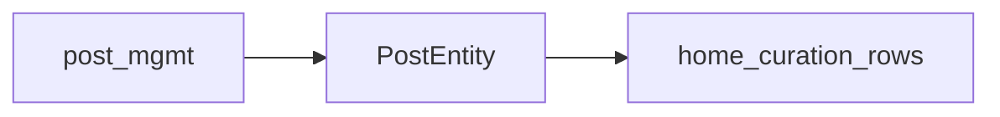

# 크리에이터 센터 — 상세기능 명세서

| 항목 | 값 |
|------|-----|
| 문서 버전 | 1.3 |
| 기준일 | 2026-03-31 |
| 개정 | 1.1 — H-8 미리보기 **미저장 미반영**(O-06). **1.2** — [`misc/기능목록.csv`](misc/기능목록.csv) v0.1(26.03.30) 요약을 **제10장**에 편입(기존 1~9장 유지). **1.3** — O-10 공개 홈 **비공개** 전환은 **별도 사이트**에서 관리. O-11 가시성·상품 표기 **「구독」**으로 통일(예: **VIP 구독**). |
| 원본 와이어 | [Figma Make — 크리에이터 센터 와이어 프레임](https://www.figma.com/make/BOWC5SOEPuUVqMnNlF5iPJ) (파일 키 `BOWC5SOEPuUVqMnNlF5iPJ`) |
| 기능목록 시트(CSV) | [`misc/기능목록.csv`](misc/기능목록.csv) — 상세·확인필요·비고 열은 원본 전문 참조 |
| 근거 조각 | [`spec/README.md`](README.md), [`spec/fragments/`](fragments/) |
| 사전 작업 로그 | [`CREATOR_CENTER_상세기능명세_작성계획.md`](../CREATOR_CENTER_상세기능명세_작성계획.md) (진행 상황 표) |

**관측 한계:** Figma Make 공개 뷰·임베디드 UI는 a11y/DOM으로 본문 와이어를 자동 추출하기 어렵다. 명세는 부록 캡처·프레임 확인·조각 문서를 근거로 한다. P2~P4 세부는 **관측 전제**와 **`TBD`**를 구분한다.

---

## 1. 개요 · 범위 · 용어

### 1.1 목적

크리에이터가 **공개 홈**에 보이는 커버·고정 포스트·큐레이션을 설정하고, 포스트·멤버십·프로필을 관리하는 **Creator Center** 관리 UI의 상세 기능을 정의한다.

### 1.2 범위

- **포함:** 와이어에 나타난 관리자 앱(좌측 내비 + 본문).
- **제외(기본):** Figma 호스트 상단의 파일명·가입 버튼·쿠키 배너 등은 **제품 기능이 아님**. 제품 내 계정·로그인은 별도 IA면 `TBD`.
- **보강:** 제품 초안 **기능목록 시트** 내용은 **제10장**에 병기한다(와이어 명세를 대체하지 않음).

### 1.3 용어 (최소)

| 용어 | 의미 |
|------|------|
| 홈(내비) | 관리 UI의 「홈」 → 본 명세에서는 **홈 큐레이션** 화면. |
| 큐레이션 그룹 | 예: 「인기 콘텐츠」 제목의 묶음. 하위에 포스트 행. |
| 가시성 | 누가 콘텐츠를 볼 수 있는지(전체 공개, VIP 구독 등). 유료 티어 표기는 **구독** 용어로 통일(O-11). |

**표준 용어·상태 일관성:** 상세는 [`fragments/cross-TERMS-PASS.md`](fragments/cross-TERMS-PASS.md) (권장 표기 표·교차 점검).

---

## 2. 전역 레이아웃 · 내비게이션

### 2.1 데스크톱 프레임 · 영역 구분

- 부록: [`appendix/figma-global-home.png`](appendix/figma-global-home.png) — 홈(홈 큐레이션) 1장.
- **Figma 크롬:** 탭·툴바·도움말·호스트 가입 등.
- **제품(와이어):** 좌측 **Creator Center**·사이드바, 본문, 본문 상단 액션(미리보기·저장 등).

### 2.2 브랜딩 · 사이드바

- 좌측 상단: **Creator Center** (강조 색). 클릭 동작은 `TBD`.

| 순서 | 라벨 | 페이지 ID |
|------|------|-----------|
| 1 | 홈 | `home-curation` |
| 2 | 포스트 관리 | `post-mgmt` |
| 3 | 멤버십 상품 | `membership` |
| 4 | 프로필 수정 | `profile` |

- 활성 항목: 배경 하이라이트. 항목 선택 시 **본문 전체**만 교체, 사이드바 유지. URL 규칙 `TBD`. 모바일/접기 사이드바 `TBD`.

### 2.3 미리보기 · 변경사항 저장 (페이지별)

| 페이지 | 미리보기 | 변경사항 저장 | 근거 부록 |
|--------|----------|----------------|-----------|
| 홈 큐레이션 | 있음(상단) | 있음(상단) | `figma-global-home.png` |
| 포스트 관리 | 있음(편집 상단) | 있음(편집 상단) | `figma-post-mgmt_1.png` |
| 멤버십 상품 | 없음(상단) — 행 미리보기만 | 없음(목록) | `figma-membership.png` |
| 프로필 수정 | 있음(상단) | 있음(상단) | `figma-profile.png` |

- **공통 패턴:** 홈 큐레이션 · 포스트 편집 · 프로필 수정.
- **예외:** 멤버십 **목록**은 상단 쌍 없음; 상품 **상세**는 조회 중심([`fragments/mem-M1-detail.md`](fragments/mem-M1-detail.md)).

---

## 3. 홈 큐레이션

**제품 결정 원문:** [`fragments/home-USER-DECISIONS.md`](fragments/home-USER-DECISIONS.md) (O-01~O-06). 아래는 확정 요약.

### 3.1 상태 배너 「홈페이지 공개 중」 (H-1)

- **의미:** 다른 화면·설정에서 공개로 전환한 **결과 피드백**. 배너는 알림이며 여기서 공개/비공개를 토글하지 않는다.
- **비공개 전환 UI (O-10 확정):** Creator Center가 아닌 **별도 사이트**에서 공개 홈 노출을 끈다. 본 앱 배너는 그 **결과만** 피드백([`fragments/home-H1.md`](fragments/home-H1.md)).

### 3.2 홈 커버 이미지 (H-2)

- 권장 **1440 × 400 px**. 업로드·교체·삭제·검증(리사이즈·포맷·용량)·실패 처리 다수 `TBD`.
- 부록에 호스트성 말풍선 겹침 가능 — 제품 포함 여부 `TBD`.

### 3.3 고정 포스트 PIN (H-3)

- PIN 배지·썸네일·제목·전체 공개·행 공개·**해제**·연필(편집). 고정 지정 플로우·동시 고정 개수 상한 `TBD`/정책.

### 3.4 큐레이션 목록 헤더 · 배지 (H-4)

- 헤더 배지 **N개** = **큐레이션 그룹** 개수. 그룹 옆 숫자 = 그 그룹의 **포스트 행 수**.

### 3.5 큐레이션 추가 (H-5)

- **인라인:** 클릭 시 새 그룹 행 삽입, 제목·공개 즉시 편집. 모달/별도 페이지 아님.
- 부록: [`appendix/figma-global-home-add-curation.png`](appendix/figma-global-home-add-curation.png) (「새 큐레이션」·빈 상태·+ 포스트 추가하기).

### 3.6 큐레이션 그룹 · 포스트 추가 모달 (H-6)

- 그룹: 드래그 핸들·순번·펼침·그룹 배지·공개·케밥(⋯). 케밥: **이름변경**, **포스트추가**, **삭제**.
- **포스트 추가 모달:** 제목 「포스트 추가」, 부제 「{그룹 제목}에 추가할 포스트를 선택하세요」, 행(썸네일·제목·열람 대상·공개/비공개·`+`), 닫기/X.
- 부록: [`appendix/figma-global-home-add-post.png`](appendix/figma-global-home-add-post.png).

### 3.7 큐레이션 행 (H-7)

- 드래그로 **같은 그룹 내 순서 변경** 시 **드롭 직후 서버 반영(자동 저장)** — 「변경사항 저장」 없이도 순서 저장(O-05).

### 3.8 미리보기 · 변경사항 저장 (H-8)

- **미리보기:** 방문자 공개 홈 확인. **미저장 로컬 편집은 미리보기에 반영하지 않음**(O-06) — **서버에 저장된 상태**만 표시. 미리보기 전에 **변경사항 저장** 필요. `home-H7` 자동 저장(드롭 직후 순서)은 저장된 것으로 간주해 프리뷰에 반영될 수 있음. 표시 수단 `TBD`.
- **변경사항 저장:** 순서 외 편집 등 서버 반영. 순서는 H-7과 중복 저장·멱등 `TBD`.
- 저장 전 검증(커버 필수·빈 그룹·동시 편집) `TBD`.

---

## 4. 포스트 관리

### 4.1 부록 범위 (PM-1)

| 파일 | 내용 |
|------|------|
| `figma-post-mgmt_1.png` | 포스트 **수정** 전체(제목·본문·우측) |
| `figma-post-mgmt_2.png` | **편집 우측 패널** (열람 권한·댓글·열람 기간). **목록 화면 아님.** |
| `figma-post-mgmt.png` | `_2`와 동일 유형(구 링크 호환) |

**포스트 목록 전체 화면** 부록은 **미확보** — 목록 UI는 [`post-USER-INPUT.md`](fragments/post-USER-INPUT.md) 기준(와이어·기획).

### 4.2 목록·편집 UI 요소 (PM-2 요약)

- **목록(와이어 기준):** 탭(전체·발행·예약·임시저장)·검색·정렬·멤버십 필터·+ 새 포스트·행 선택·일괄 삭제·권한 열 등.
- **편집:** 제목·썸네일(JPG/PNG 최대 5MB)·본문 리치 텍스트·**현재 상태**·**공개 설정**·**열람 권한**(구독형 복수·세션형 1개·구독 선택 시 세션 비활성 + 경고)·**댓글 게시판**·**열람 기간**·미리보기·변경사항 저장.

### 4.3 홈 큐레이션과의 연관 (PM-3)

1. 포스트에서 열람 권한 설정 후, 홈 큐레이션 그룹·행·고정은 동일 **포스트 ID** 참조.
2. **O-08 (확정):** 동일 포스트를 **여러 큐레이션 행에 중복 배치 허용**. 포스트 **삭제** 시 홈에 남은 **행은 자동 제거**.

**와이어 문구(열람):** 포스트를 열람할 수 있는 상품 선택(구독형 복수·세션형 1개); 선택된 상품의 구독자만 열람; 구독형 선택 시 세션형 연결 불가 알림.

---

## 5. 멤버십 상품

### 5.1 목록 (M-1)

- 부록: [`appendix/figma-membership.png`](appendix/figma-membership.png) (`preview-route=/membership`).
- 상단 미리보기/변경사항 저장 **없음**. 테이블 **작업**에 미리보기(눈).
- 검색·필터·테이블 열: ID·상품명·유형(구독/세션)·가격·판매 상태·기간·리워드·작업. 대시보드 카드는 플레이스홀더.

### 5.2 상품 상세 (M-1-detail)

- 부록: [`appendix/figma-membership-detail.png`](appendix/figma-membership-detail.png). 라우트 예: `/membership/:id`.
- 기본 정보·가격·판매 기간·가입 멤버 수 등. 상단 미리보기/저장 바 **없음**.

### 5.3 티어 ↔ 홈·포스트 라벨 (M-2)

| 상품(예) | 홈·방문자 짧은 표기 | 비고 |
|----------|---------------------|------|
| — | 전체 공개 | 상품 미연결 |
| 베이직·프리미엄 구독 | 상품명과 동일 권장 | 포스트 열람 UI와 동일 엔티티 |
| VIP 구독 | 홈·포스트·상품 모두 **VIP 구독** 등 **구독** 표기로 통일(O-11) | [`mem-M2.md`](fragments/mem-M2.md) |
| 세션형 | 홈에 동일 티어 없을 수 있음 | 포스트·상품 전용 |

---

## 6. 프로필 수정

### 6.1 필드 (PR-1)

- 부록: [`appendix/figma-profile.png`](appendix/figma-profile.png). 상단 **미리보기**·**변경사항 저장**.
- 프로필 이미지(JPG/PNG 최대 **2MB**), 닉네임, 한줄 소개, SNS 링크(플랫폼+URL+추가/삭제), **슬러그**(읽기 전용·관리자 문의). 세부 검증 `TBD`.

### 6.2 공개 프로필과 홈 (PR-2)

- 방문자 크리에이터 홈 URL은 **슬러그** 기준 가정. 프로필 필드는 방문자 헤더/카드에 반영.
- **홈 큐레이션**은 동일 방문 페이지의 **하단 영역**. 저장은 메뉴별로 분리(프로필 저장 vs 홈 저장).
- 「홈페이지 공개 중」 배너는 [`home-H1`](fragments/home-H1.md). **비공개 전환**은 **별도 사이트**(O-10).

---

## 7. 화면 간 연관 · 데이터 개요

- **단일 Post 엔티티**가 포스트 관리와 홈 큐레이션 행·고정을 연결한다(위 mermaid).
- **멤버십 상품**은 포스트 **열람 권한**과 홈 **가시성 라벨**의 기준 데이터; [`mem-M2.md`](fragments/mem-M2.md)로 명칭 정합.
- 홈 **가시성**과 포스트 **열람 권한** 라벨은 **구독** 표기로 맞춘다(O-11). 와이어 캡처에 **VIP 멤버십** 등 구 표기가 남아 있으면 구현·카피 시 **VIP 구독**으로 정합.

---

## 8. 오픈 이슈 · 부록

### 8.1 스테이크홀더 잔여

| ID | 주제 |
|----|------|
| O-12 | 조각 내 `TBD` 일괄 수집 방식 |

**해결됨(O-01~O-11 등):** [`fragments/cross-open-issues.md`](fragments/cross-open-issues.md) — **O-10** 별도 사이트에서 비공개 관리, **O-11** **구독** 표기 통일.

### 8.2 부록 캡처 인덱스

- [`appendix/README.md`](appendix/README.md) — 홈·포스트·멤버십·프로필·`add-curation`·`add-post` 등 파일별 설명.

---

## 9. 근거 조각 목록

조각 단위 원문·체크포인트는 [`README.md`](README.md) 인덱스 및 [`fragments/`](fragments/) 디렉터리를 따른다. 본 통합본과 조각이 어긋나면 **조각을 우선**하고 통합본을 갱신한다.

**체크포인트 (참고):** `CP-GLOBAL-DONE` … `CP-TERMS-ISSUES-DONE`, `CP-SPEC-DOC-DONE` (통합본 최신 개정 기준).

---

## 10. 기능목록 시트 보강 (CSV v0.1, 26.03.30)

아래는 [`misc/기능목록.csv`](misc/기능목록.csv)에서 추린 **추가 요구·문구·정책 초안**이다. **제1~9장·조각(와이어 근거)은 그대로 두며**, 시트와 중복·상충이 있으면 **제품 합의 후** 조각·상위 절을 갱신할지 결정한다. 시트의 **「확인 필요 사항」·「비고」**는 CSV 원본을 본다.

### 10.1 로그인 페이지 (시트 전용 — 기존 범위 밖 보강)

- 노출: 크리에이터 센터 로고, 안내문구(TBD, 예: 콜로소 크리에이터 전용 관리 페이지), 이메일(placeholder: 이메일을 입력하세요), 비밀번호(placeholder: 비밀번호를 입력하세요), 로그인 버튼.
- 로그인 버튼: 크리에이터 회원 DB 아이디·비밀번호 일치 여부로 판단.
- 성공: 로그인 완료.
- 실패: 에러 메시지 「로그인에 실패했습니다. 가입하지 않은 이메일이거나, 이메일 또는 비밀번호가 회원정보와 일치하지 않습니다.」입력값 유지.

### 10.2 크리에이터 센터 공통(LNB) — 시트 문구

- 좌측 상시: **크리에이터홈(큐레이션 관리)**, **포스트 관리**, **멤버십 상품 조회**, **프로필 수정** — 클릭 시 해당 메뉴 이동.
- 로고 클릭 시 **크리에이터 홈**으로 이동(시트). (와이어 명세에서는 로고 클릭 `TBD`.)
- **로그아웃:** 클릭 시 「해당 계정 로그아웃하시겠습니까」모달 → 예: 로그인 페이지, 아니오: 상태 유지.

### 10.3 크리에이터 HOME(큐레이션) — 시트 추가

- **메뉴:** 제목 「홈 큐레이션」, 설명 「나의 홈페이지에 노출할 포스트를 설정하고 순서를 지정하세요.」
- **노출 블록(시트):** 메뉴 제목·설명, **상태 관리 영역**, 커버, 고정 포스트, 큐레이션 관리, 홈 미리보기, 변경사항 저장.
- **상태 관리 영역:** 크리에이터 페이지 노출 상태 표시 — 상태 예: **정상, 대기, 숨김, (삭제)**. 본인 컨트롤 가능 여부는 시트에서 검토 과제.
- **커버:** 업로드·수정·삭제, 이미지 가이드(디자인) 필요.
- **고정 포스트(시트 플로우):** 필수 아님. 미설정 시 front 고정 영역 미노출. **기본:** 영역 클릭 → **포스트 리스트 팝업**, 크리에이터 **공개** 포스트 전체(유·무료 무관) — **단건 선택**·적용 → 팝업 닫힘·영역에 반영. placeholder: 「고정으로 노출할 포스트를 선택해보세요.」설정 후: 포스트 ID, 썸네일·고정 태그·제목·유무료(전체 공개 or 상품-멤버십명)·작성일, **포스트 변경**(동일 팝업), **삭제**(영역 기본 상태 복귀).
- **큐레이션 구좌:** N개 생성, 구좌당 포스트 N개. **D&D:** 구좌 **간** 순서 + 구좌 **내** 포스트 순서. **정상** 구좌에 포스트가 있어도 포스트 상태가 정상이 아니면 front 미노출. 큐레이션 필수 아님. 포스트 **숨김** 시 자동 제외; 구좌 내 전부 숨김이면 **구좌 비노출**.
- **구좌 기본:** 큐레이션 추가 버튼 → 하위에 구좌 생성. 구좌 항목: 순서, D&D, 제목 입력, 구좌 상태 **정상·숨김**(기본 정상), **포스트 추가** → **발행된** 포스트 리스트 팝업(**다건 선택** 가능), **구좌 삭제** → 확인 얼럿.
- **구좌 내 포스트 행:** 순서, 포스트 ID, 썸네일·제목·상태(정상/숨김/대기)·유무료·작성일, D&D, 행별 **포스트 삭제**(즉시 목록에서 제거). **포스트 추가** 재클릭 시 팝업(다건). 시트 확인 과제: 팝업에 **공개 상태만** 노출해도 되는지.
- **미리보기 URL(시트):** `www.coloso.co.kr/creator/{id}` (와이어 명세 3.8의 **저장 후 반영** 정책과 함께 해석).
- **저장 버튼:** 홈 메뉴에서 추가·수정분 일괄 저장. 성공: 「크리에이터 홈페이지 저장에 성공했습니다.」실패: 「크리에이터 홈페이지 저장에 실패했습니다. 저장 실패 사유 : {errorlog}」

### 10.4 포스트 관리 — 시트 추가

- **목록:** 발행·임시저장 전체, 정렬·검색, 행 클릭 → 상세.
- **노출:** 메뉴 제목·설명, **신규 포스트 추가**, **임시 저장 리스트**(클릭 시 임시저장 초안 팝업·항목 클릭 시 포스트 추가 페이지로 이어짐), 필터/검색(상태 정상·대기·숨김·삭제 soft delete, 포스트 ID, 제목, 연결 멤버십 상품명).
- **리스트 컬럼(시트):** 포스트 ID, 상태, 제목, 썸네일, 유/무료, 댓글 게시판 운영 여부, 작성일, **노출 시작일·종료일**.
- **상태 모델(시트 검토안):** draft / scheduled / published / hidden 및 `start_at`, `end_at`; 실제 front 노출 `published AND (start_at <= now <= end_at)` 등 — CSV 「확인 필요」참고.
- **임시저장 리스트 팝업:** 최신순. **100일** 초과 임시저장 자동 삭제, 안내 「100일 이상 지난 포스트의 경우 자동 삭제됩니다.」항목 클릭 → 포스트 추가 페이지(임시 내용 포함).
- **포스트 추가 페이지:** 레이블 「포스트 추가」. **미리보기** — URL `www.coloso.co.kr/creator/post/draft/{id}`. **임시저장**(필수값 무관) → 저장 후 포스트 관리로 이동, 이탈 시 미저장 경고. **발행하기**(시트 비고: **저장하기** 워딩 변경 검토) — 성공 시 「저장되었습니다」·목록 이동; 실패·필수값 누락 시 시트 문구.
- **콘텐츠:** 제목 필수, 썸네일(가이드·미등록 시 기본 이미지), 본문 에디터(스타일·링크·이미지·YouTube/Vimeo 임베딩·파일 첨부 가이드).
- **기본 정보(추가):** 공개 설정 정상·대기·숨김·삭제(임시저장 중에는 공개 설정 변경 불가, 기본 숨김 등), 무료 시 비로그인 열람·댓글은 로그인 기반, 유료 시 상품 필수·가입자만 열람/댓글, 열람 기간 상시 또는 기간, 댓글 Y/N.
- **포스트 상세 페이지:** 레이블 「포스트 상세」, **저장하기**, 미리보기 URL 동일 패턴, 저장 시 **front 즉시 반영**. 상세에서 현재 상태는 항상 「발행됨」(시트). 무료↔유료 양방향 변경, 기간 만료 후 상시 전환 시 front 상시 노출 등. 시트 확인 과제: 상품 판매 후 연결 해제 제한 등.

### 10.5 멤버십 상품 — 시트 추가

- **출처:** 크리에이터 **어드민**에서 콜로소 관리자 생성 상품만 조회. 크리에이터 센터에서 **추가/수정 없음**.
- **목록:** 정렬, 필터(상태 정상·대기·숨김, 유형 정기구독·단건결제, ID, 상명), 컬럼: ID, 상태, 유형, 상명, 썸네일, 판매가, 판매 시작·종료, 가입 멤버 수. 시트 확인 과제: 리워드 컬럼, 멤버십 상태 변경 시 연결 포스트 연동.
- **상세:** VIEW ONLY, 수정은 어드민. 항목 상세는 어드민 상품 상세와 동일 뷰(TBD). 시트 확인 과제: 상세에서 포스트 연결 필요 여부.

### 10.6 프로필 관리 — 시트 추가

- 조회 + 일부 수정. 시트 확인 과제: 포트폴리오 크리에이터와 데이터 선채움·추후 전체 연동.
- **필드(시트):** 프로필 이미지(수정 가능), **크리에이터명 공개용(수정 불가)**, 소개(수정), SNS(수정), **이력**(현재 front 비노출), 슬러그(수정 불가), 미리보기·**저장하기**. MVP는 노출할 정보만 반영(시트 비고). **BO 크리에이터 메뉴**와 min/max·UI 정책 동일.
- **미리보기 URL:** `www.coloso.co.kr/creator/{id}`.
- **저장:** 즉시 반영 front. 필수·중복 검사 대상 예: 크리에이터명(공개용). 성공/실패 메시지 시트 문구.

### 10.7 기타

- 시트 하단: **도메인명 정리 필요**.
- 설명하지 않은 부분은 **기존 프로세스와 동일**(시트 상단 주석).

### 10.8 시트와 와이어 명세의 병행

| 구분 | 역할 |
|------|------|
| 제1~9장·조각 | Figma 와이어·부록·O-01~O-11 **관측·결정**(잔여 이슈는 O-12 등) |
| 제10장·CSV | 제품/운영 **기능목록 초안**, URL·메시지·상태 모델·BO 연동 |

동일 주제에서 서술이 다르면(예: 고정 포스트 팝업 vs 카드, 포스트 추가 다건 vs 모달 `+`, 프로필 공개명 수정 가능 여부) **삭제하지 않고** 양쪽을 유지한 채 이슈로 추적한다([`fragments/cross-open-issues.md`](fragments/cross-open-issues.md) **O-12**·별도 항목 권장).
