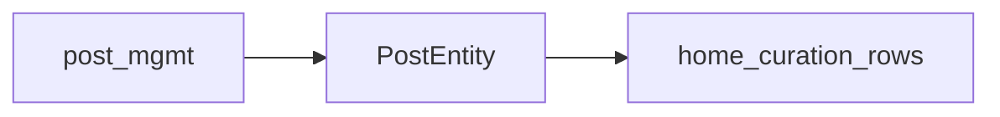

# PM-3 — 포스트 관리 ↔ 홈 큐레이션 연관

<!-- CP-POST 확정: 2026-03-31 — O-08 문장·체크 반영 -->

## 데이터 플로우

1. **포스트 관리**에서 포스트를 생성·수정하고, **열람 권한**(전체 공개 / 구독·세션 상품 연결)을 설정한다. 와이어 문구: 「선택된 상품의 구독자만 이 포스트를 열람할 수 있습니다.」 **구독형 선택 시 세션형 연결 불가** 알림(노란 배경)은 [`figma-post-mgmt_2.png`](../appendix/figma-post-mgmt_2.png) 우측 패널. 전체 편집 화면: [`figma-post-mgmt_1.png`](../appendix/figma-post-mgmt_1.png).
2. **홈 큐레이션**의 그룹·행·고정 카드는 동일 **포스트 ID**를 참조한다 (`home-H6`·`home-H7`·`home-H3`).

## 연관 다이어그램

## O-08 — 제품 결정 (확정)

[`post-USER-INPUT.md`](post-USER-INPUT.md) PM-3:

1. **동일 포스트를 여러 큐레이션 행에 중복 배치:** **허용(예).**
2. **포스트 삭제 시** 홈 큐레이션에 남아 있던 **행:** **자동 제거.**

## 와이어 문구 (열람 권한)

- 「포스트를 열람할 수 있는 상품을 선택하세요. 구독형은 복수 선택, 세션형은 1개만 선택 가능합니다.」
- 「선택된 상품의 구독자만 이 포스트를 열람할 수 있습니다.」
- 「구독형 상품이 선택되어 세션형 상품은 연결할 수 없습니다.」(상호 배제 시)

구현 시 홈 쪽 가시성 라벨(전체 공개 / VIP 구독 등)과 **상품·티어** 명칭을 **구독**으로 통일할 것 — **O-11**, `mem-M2.md`. 홈 **포스트 추가** 모달 라벨(예: 프리미엄 구독)과도 정합 (`figma-global-home-add-post.png`).

**체크포인트:** `CP-POST-DONE`

**다음:** `mem-M1.md`
